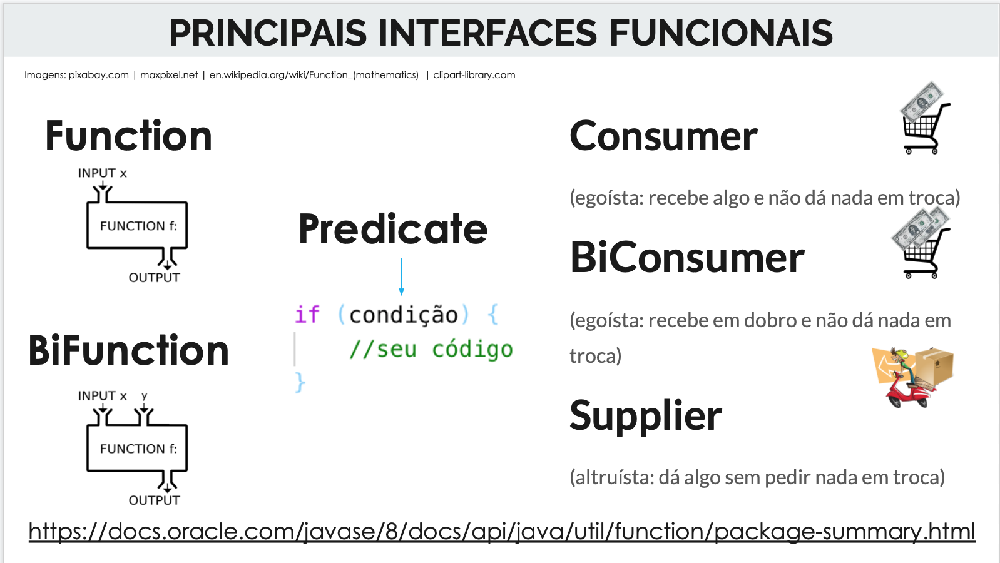

:source-highlighter: highlightjs
:numbered:
:icons: font

ifdef::env-github[]
:outfilesuffix: .adoc
:caution-caption: :fire:
:important-caption: :exclamation:
:note-caption: :paperclip:
:tip-caption: :bulb:
:warning-caption: :warning:
endif::[]

= Programação Funcional, Expressões Lambda e Streams no Java 8

Fornece um conjunto de projetos para permitir praticar a programação funcional no Java 8
e entender o funcionamento de novos recursos da linguagem, como Streams e Expressões Lambda.

[NOTE]
==== 
- https://docs.google.com/presentation/d/e/2PACX-1vTJE9Dt23OdsfZda7mBuinRpy8BldyKlxfVbXalwZb2L4BFqVkkpb8SWBdIeWBhdfbl3RLOTv8J60Nd/pub?start=false&loop=false&delayms=3000[Apresentação e vídeo de introdução à programação funcional.]
- link:programacao-funcional-java8.pptx[Breve apresentação sobre Programação Funcional em Java].
====

O recurso de Streams do Java 8 (não confundir com _InputStream_ e _OutputStream_ usados
nos projetos de chat) permitem processamento de dados de forma sequencial e paralelo.
Neste último caso, processamento paralelo (utilizando múltiplas CPUs de uma mesma máquina)
tem tudo a ver com sistemas distribuídos.
Desta forma, tais recursos são de fundamental importância para complementar a formação 
do estudante em programação.

== Material de Apoio

- https://docs.google.com/presentation/d/e/2PACX-1vTJE9Dt23OdsfZda7mBuinRpy8BldyKlxfVbXalwZb2L4BFqVkkpb8SWBdIeWBhdfbl3RLOTv8J60Nd/pub?start=false&loop=false&delayms=60000[Apresentação sobre os fundamentos de programação funcional].
- https://www.oracle.com/technetwork/pt/articles/java/streams-api-java-8-3410098-ptb.html[Curso Streams e Expressões Lambda do Java 8]
- http://bit.ly/2I2U5bU[Curso JDK 8 MOOC: Lambdas and Streams Introduction]
- https://www.oracle.com/technical-resources/articles/java/ma14-java-se-8-streams.html[Processing Data with Java SE 8 Streams, Part 1]

O primeiro link é um tutorial em português. O segundo é um curso completo em vídeo, mas em inglês.
Acessando o segundo link você pode ter acesso aos slides do curso.
Concluindo o curso você ganha um certificado de participação da Oracle.
Como as inscrições não estão abertas a todo momento, você pode não conseguir acessar o material. 
Mas os vídeos estão disponíveis no https://youtube.com/playlist?list=PLMod1hYiIvSZL1xclvHcsV2dMiminf19x[YouTube].
Apesar de serem em inglês, os vídeos contam com legendas oficiais (que podem ser traduzidas para o português).

== Interfaces Funcionais

Ao iniciar em programação funcional no Java 8, é preciso aprender um novo vocabulário.

Conhecendo os termos deste vocabulário, quando você vir um método que solicita como parâmetro um objeto:

- `Predicate`, saberá que pode passar uma expressão lambda que representa uma função que recebe um objeto (como `Student`)
e retorna um valor `boolean`, representando uma condição em relação a tal objeto.
- `Consumer`, saberá que pode passar uma expressão lambda que representa uma função que recebe um objeto (como `Student`),
faz qualquer coisa com ele (consome) e não retorna nada (`void`). 

Assim, para entender este novo vocabulário, você poderá ver o JavaDoc do pacote `java.util.function` no seu IDE, ou acessar https://docs.oracle.com/javase/8/docs/api/java/util/function/package-summary.html[aqui].
Entender este vocabulário faz toda a diferença na sua fluência em programação funcional.
